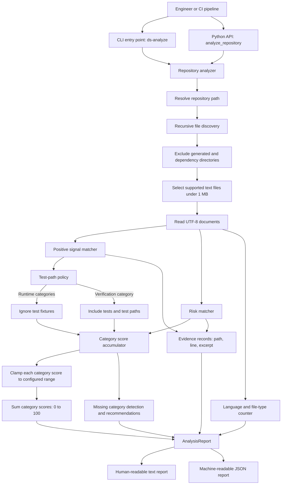
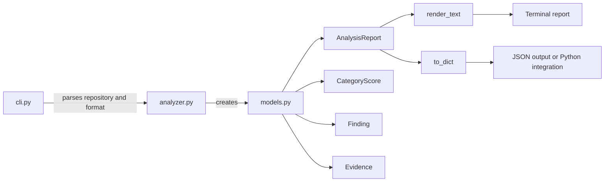

# Distributed Systems Architectural Analyzer

`distributed_systems_analyzer` is a dependency-free Python API and command-line
tool that reviews an application's source repository for evidence of
distributed-systems readiness.

The analyzer helps engineers answer questions such as:

- Does the application show evidence of handling partial failures?
- Can its workload scale horizontally or be partitioned?
- Are replication, failover, and recovery represented in the repository?
- Does the code describe consistency boundaries and delivery semantics?
- Are interfaces designed to evolve?
- Can operators observe, configure, deploy, and verify the system?

The tool produces a detailed report with a score out of `100`, a category
breakdown, detected strengths, risky patterns, missing or unverified capabilities,
recommendations, and source evidence with file paths and line numbers.

The rubric is based on the enduring architectural concerns described in Martin
Kleppmann's *Designing Data-Intensive Applications*: reliability, scalability,
maintainability, replication, partitioning, transactions, partial failures,
consistency, evolving dataflows, and verification.

## Important Scope

This is an explainable static-analysis tool. It analyzes evidence stored in a
repository; it does not inspect a running production system.

A high score means that the repository contains evidence of distributed-systems
design practices. It does not prove that the implementation is correct. A low score
does not automatically mean an application is poorly designed: a small
single-process application may not need distributed architecture.

Use the report as an architectural review checklist and a starting point for
engineering discussions.

## How It Works

The analyzer performs the following steps:

1. Resolves the supplied repository path.
2. Recursively discovers supported text files.
3. Skips generated, dependency, cache, and version-control directories.
4. Reads UTF-8 text files smaller than `1 MB`.
5. Applies explainable regular-expression heuristics to file paths and content.
6. Adds points for detected architectural signals.
7. Subtracts points for risky patterns.
8. Clamps each category score between `0` and its configured maximum.
9. Adds the seven category scores to produce a score out of `100`.
10. Returns a text or JSON report with evidence and recommendations.

Test files contribute to the verification and maintainability category. They are
excluded from runtime strengths and risks so fixture content is not mistaken for
production architecture.

## Architecture Diagram



### Internal Components



## Installation

From the parent repository:

```bash
python3 -m pip install ./code_development_practices
```

From this directory:

```bash
python3 -m pip install .
```

The package installs the `ds-analyze` command.

The analyzer itself has no third-party runtime dependencies and requires Python
`3.9` or newer.

## CLI Usage

Analyze a repository and print a readable architectural report:

```bash
ds-analyze /path/to/application/repository
```

Run the package directly without installing it:

```bash
cd code_development_practices
python3 -m distributed_systems_analyzer /path/to/application/repository
```

Generate JSON for CI pipelines, dashboards, or further automation:

```bash
ds-analyze /path/to/application/repository --format json
```

View CLI help:

```bash
ds-analyze --help
```

## Python API

Applications can call the analyzer directly:

```python
from distributed_systems_analyzer import analyze_repository

report = analyze_repository("/path/to/application/repository")

print(report.score)
print(report.render_text())

data = report.to_dict()
print(data["category_scores"])
print(data["risks"])
```

The public API returns an `AnalysisReport` containing:

| Field | Description |
| --- | --- |
| `repository` | Absolute path of the analyzed repository |
| `score` | Total readiness score from `0` to `100` |
| `files_scanned` | Number of supported text files analyzed |
| `category_scores` | Per-category score, maximum, and evidence summary |
| `strengths` | Positive architectural signals with source evidence |
| `risks` | Risky patterns with evidence and recommendations |
| `gaps` | Categories with no static evidence and suggested next steps |
| `languages` | Detected file types and counts |
| `limitations` | Caveats that should be considered when reviewing the report |

## Scoring System

The score is intentionally transparent. Each positive signal contributes points to
one category. Risk patterns subtract points from the relevant category. Each
category is clamped to its own valid range, and the category scores are summed.

```text
category score = clamp(sum(detected signal points) - sum(risk penalties), 0, category maximum)
total score    = sum(category scores)
```

### 1. Reliability and Partial Failures: 20 Points

This category checks whether the application represents bounded waits, repeatable
requests, health signaling, and resilience controls.

| Signal | Points | Examples of detected terms |
| --- | ---: | --- |
| Timeouts | 4 | `timeout`, `deadline`, `connect_timeout`, `read_timeout` |
| Retries | 3 | `retry`, `retries`, `backoff`, `tenacity` |
| Idempotency | 4 | `idempotency`, `deduplicate`, `request_id` |
| Health checks | 3 | `healthz`, `readiness`, `liveness`, `healthcheck` |
| Resilience controls | 6 | `circuit breaker`, `bulkhead`, `rate limit`, `graceful shutdown` |

### 2. Scalability and Partitioning: 15 Points

This category checks for evidence that work can be distributed as load grows.

| Signal | Points | Examples of detected terms |
| --- | ---: | --- |
| Horizontal execution | 4 | `autoscale`, `replicas`, `workers`, `stateless`, `load balancing` |
| Partitioning | 5 | `partition`, `shard`, `consistent hash`, `hot spot` |
| Caching | 3 | `cache`, `redis`, `memcached`, `cdn` |
| Queueing | 3 | `kafka`, `rabbitmq`, `sqs`, `pubsub`, `consumer group` |

### 3. Replication and Availability: 15 Points

This category checks for evidence that stateful dependencies and deployments can
tolerate node or zone failures.

| Signal | Points | Examples of detected terms |
| --- | ---: | --- |
| Replication | 5 | `replica`, `replication`, `replicaset`, `read replica` |
| Failover | 4 | `failover`, `leader election`, `primary`, `follower`, `quorum`, `consensus` |
| Availability-aware deployment | 3 | `PodDisruptionBudget`, `availability zone`, `multi-AZ`, `anti-affinity` |
| Backup and recovery | 3 | `backup`, `restore`, `disaster recovery`, `point in time` |

### 4. Consistency and Correctness: 15 Points

This category checks whether concurrent updates, transactional boundaries, and
cross-service delivery semantics are represented.

| Signal | Points | Examples of detected terms |
| --- | ---: | --- |
| Transactions | 4 | `transaction`, `begin`, `commit`, `rollback`, `atomic` |
| Concurrency controls | 4 | `lock`, `mutex`, `compare and swap`, `optimistic`, `etag`, `version check` |
| Delivery correctness | 4 | `outbox`, `saga`, `deduplicate`, `exactly once`, `at least once`, `idempotent` |
| Integrity constraints | 3 | `unique`, `foreign key`, `constraint`, `check constraint` |

### 5. Dataflow and Evolution: 10 Points

This category checks whether interfaces, schemas, and asynchronous dataflows can
evolve safely.

| Signal | Points | Examples of detected terms |
| --- | ---: | --- |
| Versioned interfaces | 3 | `/v1/`, `api version`, `schema version`, `protobuf`, `.proto` |
| Migrations | 3 | `migration`, `alembic`, `flyway`, `liquibase`, `schema registry` |
| Stream or event flows | 4 | `event`, `stream`, `consumer`, `producer`, `cdc` |

### 6. Operability and Observability: 15 Points

This category checks whether engineers can deploy, configure, and diagnose the
application in production.

| Signal | Points | Examples of detected terms |
| --- | ---: | --- |
| Logging | 3 | `logging`, `logger`, `loglevel`, `structured log` |
| Metrics | 3 | `metrics`, `prometheus`, `statsd`, `counter`, `histogram` |
| Tracing | 3 | `opentelemetry`, `trace_id`, `tracing`, `span_id` |
| External configuration | 3 | `os.environ`, `getenv`, `ConfigMap`, `secretKeyRef`, `vault` |
| Deployment descriptors | 3 | `Dockerfile`, `docker-compose`, `Deployment`, `terraform`, `helm`, `kubernetes` |

### 7. Verification and Maintainability: 10 Points

This category checks whether the repository supports repeatable engineering work
and failure-mode validation.

| Signal | Points | Examples of detected terms |
| --- | ---: | --- |
| Automated tests | 4 | `pytest`, `unittest`, `jest`, `junit`, `rspec`, `go test`, test file paths |
| Failure testing | 3 | `fault injection`, `chaos`, `toxiproxy`, `network partition`, `kill node` |
| Documentation | 2 | `README`, `architecture`, `runbook`, `ADR`, `design doc` |
| Automation | 1 | `Makefile`, `github/workflows`, `gitlab-ci`, `Jenkinsfile`, `tox.ini`, `pre-commit` |

## Risk Penalties

The analyzer also flags patterns that can prevent an application from behaving
reliably when it is distributed.

| Risk | Penalty | Why it matters | Suggested response |
| --- | ---: | --- | --- |
| Python HTTP call without an explicit timeout | `-3` reliability points | A dependency call may wait indefinitely during partial failure | Configure connect and read timeouts and define retry behavior |
| Hard-coded `localhost` or `127.0.0.1` dependency | `-2` scalability points | The component may be coupled to one machine | Externalize service endpoints |
| Local durable state such as SQLite, `.db`, or file writes | `-2` availability points | Shared state may become a single-node dependency | Use replicated durable storage or document why the state is ephemeral |
| Sleep-based coordination | `-2` correctness points | Timing assumptions are fragile under pauses and variable network delays | Use synchronization, leases, queues, or acknowledgements |

## Interpreting the Score

The total score is a prioritization aid, not a certification. Review the evidence
and category breakdown before drawing conclusions from the number.

| Score | Suggested interpretation |
| ---: | --- |
| `0-24` | Little distributed-systems evidence is present. Confirm whether the application is intentionally single-node or missing foundational controls. |
| `25-49` | Some practices are represented, but important failure, scale, or operational gaps likely need review. |
| `50-74` | The repository shows meaningful readiness. Focus on weaker categories and validate production settings outside the repository. |
| `75-100` | Broad architectural evidence is present. Confirm implementation quality with integration tests, failure tests, load tests, and operational review. |

## Reading the Report

A text report contains:

1. Repository path, score, number of files scanned, and detected file types.
2. A per-category score breakdown.
3. Strengths with source evidence.
4. Risks with source evidence and recommendations.
5. Missing or unverified capabilities with recommended next steps.
6. Static-analysis limitations.

Example:

```text
Distributed Systems Architectural Readiness Report
Repository: /path/to/application
Readiness score: 42/100
Files scanned: 37

Score breakdown
- Reliability and partial failures: 7/20 - Evidence detected for timeouts, retries.

Risks
- [Reliability and partial failures] unbounded network call:
  A Python HTTP request may wait without an explicit timeout.
  Evidence: client.py:18: requests.get(service_url)
  Recommendation: Set an explicit connect/read timeout and define retry behavior.
```

## Practical Ways to Use the Tool

### Review an Existing Application

Run the analyzer against a service repository before an architecture review:

```bash
ds-analyze ~/src/orders-service
```

Start with the lowest-scoring categories. Review each finding against the
application's requirements and production environment.

### Compare Progress Over Time

Generate JSON before and after architectural improvements:

```bash
ds-analyze ~/src/orders-service --format json > before.json
ds-analyze ~/src/orders-service --format json > after.json
```

Compare the reports after adding health checks, timeouts, metrics, deployment
configuration, migrations, or failure-mode tests.

### Use It in CI

Store the JSON report as a build artifact:

```bash
ds-analyze . --format json > distributed-systems-report.json
```

Teams can add their own policy wrapper around the JSON output. For example, a
service team may require evidence of explicit timeouts and health checks before
deployment without requiring every repository to reach an arbitrary total score.

### Prepare for Architecture Discussions

Use the findings as prompts:

- Which calls cross process or network boundaries?
- What happens if a dependency is slow, unreachable, or returns an ambiguous result?
- Which operations must be idempotent?
- Where does durable state live, and how is it replicated?
- What consistency guarantee does each workflow require?
- How are schemas and API versions evolved?
- Which signals allow operators to detect and diagnose failure?

## Files Scanned

The analyzer reads common source, configuration, infrastructure, documentation, and
schema formats, including:

```text
.py .go .java .js .ts .tsx .rs .rb .php .scala .kt
.c .cpp .h .sql .proto .tf .hcl .yaml .yml .json .toml
.xml .html .md .sh .conf .ini .properties .gradle .env
Dockerfile Makefile Procfile requirements.txt terraform.lock.hcl
```

It skips:

```text
.git .hg .venv node_modules vendor target build dist
__pycache__ .pytest_cache .mypy_cache .tox
```

Files larger than `1 MB`, unsupported file types, unreadable files, and non-UTF-8
files are ignored.

## Limitations

Static analysis cannot determine everything that matters in a distributed system.
Reviewers should confirm findings against the deployed architecture.

The analyzer cannot reliably inspect:

- Managed-service settings stored outside the repository
- Production topology and availability-zone placement
- Real traffic shape, load distribution, skew, and hot partitions
- Service-level objectives and alert quality
- Database isolation levels and consistency settings configured externally
- Operator practices, incident response, and recovery drills
- Whether a detected keyword represents a complete or correct implementation

The current heuristics are intentionally explainable and conservative in scope.
They can be extended in `distributed_systems_analyzer/analyzer.py`.

## Development

Run the test suite from this directory:

```bash
python3 -m unittest discover -s tests -v
```

Run the analyzer against the example scripts in the parent repository:

```bash
python3 -m distributed_systems_analyzer ../adhoc_scripts
```

Project structure:

```text
code_development_practices/
|-- distributed_systems_analyzer/
|   |-- __init__.py
|   |-- __main__.py
|   |-- analyzer.py
|   |-- cli.py
|   `-- models.py
|-- tests/
|   `-- test_analyzer.py
|-- pyproject.toml
`-- README.md
```
